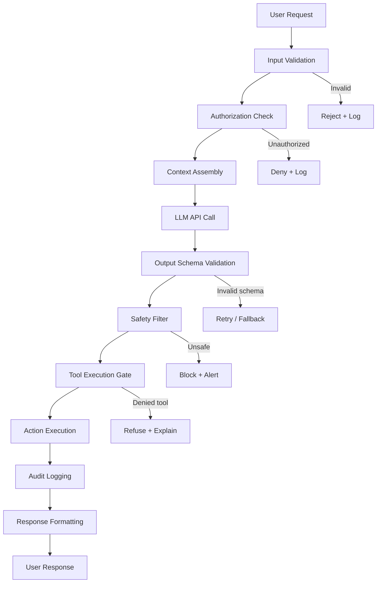

# The Harness Principle

> **The LLM is one component. The harness is the product.**

---

## Purpose

Every production AI system requires a deterministic wrapper around the model. This wrapper — the **harness** — is what separates a demo from a product. The harness validates, authorizes, executes, and logs every action the model proposes.

---

## Why

LLMs are probabilistic. They produce the statistically likely next token, not the guaranteed correct action. Without a harness:
- Invalid outputs reach users
- Unauthorized operations execute
- Failures produce no audit trail
- Cost spirals without enforcement
- Security boundaries exist only in the system prompt (trivially bypassable)

The harness moves these guarantees from the model layer (probabilistic) to the code layer (deterministic).

---

## The Standard Harness Architecture



---

## The Seven Harness Components

### 1. Input Validation
Treat all user input as untrusted. Validate types, lengths, allowed characters, and injection patterns before passing to the model.

**What to validate:**
- Input length (prevent context stuffing attacks)
- Allowed characters and encoding
- Prompt injection patterns (`Ignore previous instructions...`)
- Business logic bounds (user can only query their own data)

### 2. Authorization Check
The model cannot enforce authorization — it doesn't know who the user is. The harness does.

**Pattern:** Resolve user identity and permissions before context assembly. Never pass authorization decisions to the model.

### 3. Context Assembly
Deterministically construct the context window. The model receives only what it's authorized to see.

**Pattern:** Pull context from structured sources (databases, vector stores) with explicit permission filtering — never from raw user input alone.

### 4. Output Schema Validation
Enforce a strict schema on model output. Use Pydantic (Python), Zod (TypeScript), or structured output APIs.

```python
# Correct: Enforce schema
from pydantic import BaseModel
class AgentAction(BaseModel):
    action: Literal["search", "create", "update", "delete"]
    target: str
    parameters: dict[str, str]

response = client.beta.chat.completions.parse(
    model="gpt-4o",
    response_format=AgentAction,
    messages=[...]
)
```

```python
# Wrong: Trust model output as-is
raw_output = response.choices[0].message.content
eval(raw_output)  # ← Never do this
```

### 5. Safety Filter
Apply rule-based safety checks on validated output. These are deterministic — they do not delegate safety decisions to another model.

**Pattern:** Maintain a blocklist of forbidden operations, patterns, and targets. Apply before execution.

### 6. Tool Execution Gate
For agentic systems, require explicit approval for high-impact operations. Never let the model directly execute writes, deletions, or external calls without a gate.

**Tiered approach:**
- **Tier 1 (auto-approve):** Read-only operations
- **Tier 2 (log + execute):** Reversible writes
- **Tier 3 (human approval):** Irreversible or high-impact operations

### 7. Audit Logging
Log every harness decision — not just final actions. This is non-negotiable for enterprise deployments.

**Minimum log payload:**
```json
{
  "timestamp": "ISO8601",
  "session_id": "uuid",
  "user_id": "string",
  "input_hash": "sha256",
  "model": "provider/model-version",
  "tokens_used": { "input": 0, "output": 0, "cost_usd": 0.0 },
  "action_proposed": "string",
  "action_approved": true,
  "execution_result": "string",
  "latency_ms": 0
}
```

---

## Tradeoffs

| Benefit | Cost |
|---------|------|
| Reliability and predictability | Additional latency (validation layers) |
| Auditability and compliance | Engineering complexity |
| Security enforcement | More code to maintain |
| Cost control | Upfront design time |

**The tradeoffs are non-negotiable for production.** A system without a harness is a demo, not a product.

---

## Anti-Patterns

### ❌ Security through system prompt
```
# Wrong
system: "Never access files outside /data directory"

# Right
harness: validate_path(tool_input.path, allowed_prefix="/data")
```
System prompts are instructions to a probabilistic model. They are not access controls.

### ❌ Trusting structured output because you asked for JSON
The model can return invalid JSON, valid JSON with wrong schema, or valid JSON with harmful content. Validate all three.

### ❌ The "smart model" exception
"This model is too smart to need guardrails." This statement predicts a future incident with high confidence. All models hallucinate. All models can be manipulated. The harness exists for the times they are.

---

## Enterprise Considerations

- **EU AI Act Article 9:** Requires risk management systems for high-risk AI — the harness IS the risk management system. Document each component.
- **SOC 2 / ISO 27001:** Audit logging (component 7) is mandatory. Ensure logs are tamper-evident and retained per your compliance period.
- **Financial services:** Tier 3 approvals must be human-in-the-loop for regulated operations. No exceptions.
- **Healthcare (HIPAA):** Input validation must prevent PHI from entering model context unless explicitly authorized and logged.

---

## Checklist

- [ ] Input validation rejects prompt injection patterns
- [ ] Authorization resolved before context assembly
- [ ] Context filtered by user permissions
- [ ] Output validated against strict schema
- [ ] Safety filter applied before execution
- [ ] Tool execution gate enforced by tier
- [ ] Every harness decision logged with minimum payload
- [ ] Logs are immutable and retained per compliance requirement
