# Level 0: AI Foundations

> **Prerequisites:** None
> **Goal:** Understand how to engineer systems around LLMs — not just use them

---

## Why This Level Exists

Most AI engineering failures are not LLM failures. They are **system design failures** — engineers who understood what the model could do but not how to build reliably around it.

This level builds the mental models required before writing a single line of AI code. Skip it and you will spend months debugging problems that have known solutions.

---

## What You'll Learn

1. How LLMs process information (and why it matters for engineering)
2. The Harness Principle — the deterministic wrapper that makes AI reliable
3. The 50/50 Rule — the most important rule in AI engineering
4. LLM failure mode taxonomy — know your enemy before you fight it
5. Provider landscape — how to choose without locking in
6. Cost mental models — reasoning about token budgets as engineering constraints
7. Latency tradeoffs — why speed is a first-class design concern

---

## Contents

| File | What It Covers |
|------|---------------|
| [01-how-llms-think.md](./01-how-llms-think.md) | Tokens, attention, context windows as engineering primitives |
| [02-the-harness-principle.md](./02-the-harness-principle.md) | The deterministic wrapper standard |
| [03-50-50-rule.md](./03-50-50-rule.md) | 50% AI reasoning, 50% deterministic code |
| [04-failure-modes.md](./04-failure-modes.md) | Taxonomy of LLM failure modes |
| [05-provider-landscape.md](./05-provider-landscape.md) | OpenAI, Anthropic, Google, Azure — decision framework |
| [06-cost-mental-models.md](./06-cost-mental-models.md) | Token budget thinking |
| [07-latency-tradeoffs.md](./07-latency-tradeoffs.md) | Why speed matters and how to reason about it |
| [checklists/foundations-readiness.md](./checklists/foundations-readiness.md) | Readiness gate before Level 1 |

---

## Core Mental Model

```mermaid
graph LR
    A[User Input] --> B[Your Harness]
    B --> C[Context Assembly]
    C --> D[LLM API]
    D --> E[Output Parsing]
    E --> F[Validation Layer]
    F --> G[Execution Layer]
    G --> H[Audit Log]
    H --> I[User Response]
    
    style B fill:#2d4a8a,color:#fff
    style F fill:#2d4a8a,color:#fff
    style G fill:#2d4a8a,color:#fff
    style H fill:#2d4a8a,color:#fff
    style D fill:#6b4a9a,color:#fff
```

**The LLM (purple) is one box. Your engineering (blue) is four boxes.** This is intentional.

---

## The Foundational Question

Before building any AI feature, answer these four questions:

1. **What is the task boundary?** — Where does AI reasoning end and deterministic code begin?
2. **What is the failure cost?** — What happens when the model is wrong? Embarrassment? Data loss? Financial loss?
3. **What is the trust boundary?** — What data, tools, and systems can the model access? What can it not?
4. **What is the evaluation strategy?** — How will you know it's working? How will you know when it stops working?

If you cannot answer all four, stop. You are not ready to build.

---

## Anti-Patterns at This Level

### ❌ "The model is smart enough to figure it out"
**Root cause:** Conflating intelligence with reliability. LLMs are impressively capable but probabilistically unreliable. Without a harness, every invocation is a roll of the dice.

### ❌ "We'll add guardrails later"
**Root cause:** Treating safety and reliability as features rather than architecture. By the time you add them later, you're refactoring your entire system.

### ❌ "We just need a better prompt"
**Root cause:** Treating prompt engineering as the primary reliability lever. Prompts are soft constraints. Deterministic code is a hard constraint. Use both.

### ❌ "We'll evaluate it manually"
**Root cause:** Not treating AI behavior as a measurable system property. Manual evaluation doesn't scale and doesn't catch regressions.

---

## Enterprise Considerations

At enterprise scale, every item in this level becomes a compliance concern:
- **Failure modes** map to regulatory risk categories
- **Cost mental models** become CFO-reported line items
- **Provider landscape** decisions trigger procurement, legal, and security reviews
- **Latency tradeoffs** appear in SLA negotiations

Do not skip this level because it feels too basic. Revisit it every 6 months — your understanding will compound.

---

## Readiness Gate

Before proceeding to Level 1, complete the [Foundations Readiness Checklist](./checklists/foundations-readiness.md).

**Minimum bar:** You can explain the Harness Principle, the 50/50 Rule, and three LLM failure modes to a non-technical stakeholder.
