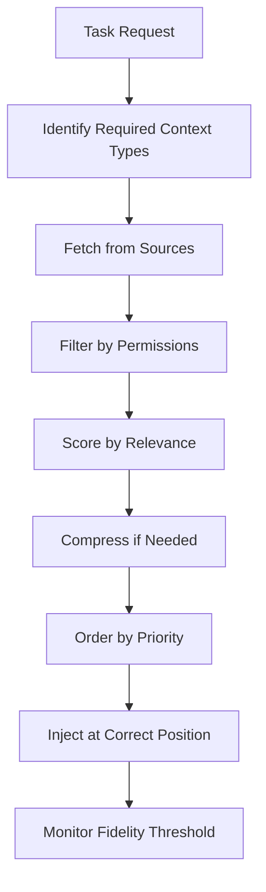

# Level 2: Context Engineering

> **Prerequisites:** Level 1: Prompt Engineering
> **Goal:** Build systems that provide the right information, to the right model, at the right time

---

## Why Context Engineering Matters More Than Prompt Engineering

Prompt engineering optimizes *how* you ask. Context engineering optimizes *what you give the model to work with.* In production systems, context quality is the primary determinant of output quality — not prompt wording.

The competitive advantage has shifted: models are commoditized, model intelligence is commoditized. What differentiates great AI systems is the **information pipeline** — how precisely you curate, structure, and deliver context.

> **Context Engineering:** The discipline of designing, curating, and managing the information made available to a language model at inference time.

---

## The Context Fidelity Standard

Context fidelity = **Signal / Noise**.

High fidelity context: everything the model needs, nothing it doesn't.
Low fidelity context: irrelevant information dilutes the signal.

**The goal is not to maximize context.** It is to maximize *relevant* context within the fidelity threshold.

### The Fidelity Threshold
Every model has a "fidelity threshold" — the context length at which its reasoning begins to degrade. This is model-specific and task-specific. It is NOT the same as the context window limit.

**Measuring your fidelity threshold:**
1. Place a critical piece of information at different positions in a long context
2. Measure how often the model correctly uses that information
3. The point at which accuracy drops is your fidelity threshold

**Rule:** Never fill more than 60% of your fidelity threshold in production. Leave 40% for runtime context injection.

---

## Contents

| File | What It Covers |
|------|----------------|
| [principles/context-fidelity.md](./principles/context-fidelity.md) | The signal-to-noise ratio standard |
| [principles/lost-in-the-middle.md](./principles/lost-in-the-middle.md) | Placement rules for critical information |
| [principles/progressive-disclosure.md](./principles/progressive-disclosure.md) | Load context only when needed |
| [principles/fidelity-threshold.md](./principles/fidelity-threshold.md) | Needle-in-haystack testing methodology |
| [principles/structured-state-offloading.md](./principles/structured-state-offloading.md) | Scratchpads and state management |
| [types/](./types/) | 13 context types with assembly patterns |
| [templates/CLAUDE.md.template](./templates/CLAUDE.md.template) | Standard CLAUDE.md for any project |
| [templates/project-context.template.md](./templates/project-context.template.md) | Project context document |
| [templates/task-brief.template.md](./templates/task-brief.template.md) | Per-task context brief |
| [anti-patterns/context-anti-patterns.md](./anti-patterns/context-anti-patterns.md) | Context engineering failures |
| [checklists/context-checklist.md](./checklists/context-checklist.md) | Context quality gate |

---

## The 13 Context Types

Every context you give a model belongs to one of these categories. Understanding the category helps you decide what to include, when to include it, and how to structure it.

| Type | What It Contains | When to Include |
|------|-----------------|-----------------|
| **Project Context** | Purpose, stack, conventions, constraints | Always |
| **Business Context** | Domain rules, stakeholder requirements, regulatory constraints | When domain knowledge required |
| **Architecture Context** | System design, component relationships, data flows | When architectural decisions required |
| **Conversation Context** | Conversation history (compressed) | Multi-turn interactions |
| **Knowledge Context** | Retrieved documents, search results | RAG-powered tasks |
| **Memory Context** | Past decisions, preferences, learned patterns | Long-running agents |
| **User Context** | Permissions, role, preferences, history | User-facing applications |
| **Task Context** | Current task specification, acceptance criteria | Every task |
| **Code Context** | Relevant files, functions, tests | Code generation/review |
| **Historical Context** | Past incidents, previous attempts, known failures | Complex debugging |
| **Decision Context** | Past architectural decisions (ADRs) | Architectural work |
| **Risk Context** | Known risks, mitigation strategies | Security/compliance work |
| **Dependency Context** | External dependencies, API contracts, version constraints | Integration work |

---

## Context Assembly Pattern



**The assembly is deterministic.** Every decision is made by your harness — not left to the model.

---

## Critical Placement Rules (Anti-"Lost in the Middle")

Research shows models reliably attend to:
- **First 25%** of context window
- **Last 25%** of context window

The middle 50% is where attention drops.

**Rule:** Place critical constraints, role definitions, and output specifications at both the **beginning** AND **end** of your system prompt for long contexts.

```xml
<!-- Beginning — always included -->
<role>You are a security engineer. You MUST flag any SQL injection vulnerabilities.</role>
<task>Review the following code...</task>

<!-- ... (long code to review) ... -->

<!-- End — repeat critical constraints for long contexts -->
<reminder>
- You are a security engineer
- Flag ALL SQL injection vulnerabilities, even if there are many
- Output format: JSON array of findings
</reminder>
```

---

## Progressive Disclosure

**The most underused context engineering technique.**

Do not load all possible context at the start. Load it when the model's reasoning indicates a need.

```python
# Wrong — loads everything upfront
context = assemble_full_context()  # 50,000 tokens

# Correct — progressive disclosure
base_context = assemble_base_context()  # 2,000 tokens

# Tool: load more context on demand
def get_additional_context(topic: str) -> str:
    """Load context based on model's expressed need."""
    return context_store.query(topic, top_k=5)
```

This pattern is most powerful in agentic systems where the task space is large but any individual invocation only needs a subset of available information.

---

## Anti-Patterns

### ❌ Dumping Everything into the System Prompt
**Symptom:** Context window approaching limit. Reasoning quality degrades.
**Fix:** Categorize context. Include only what's needed for the current task.

### ❌ Stale Context
**Symptom:** Model reasons about outdated state.
**Fix:** Timestamp all context. Include a "context freshness" check in your harness.

### ❌ Uncompressed Conversation History
**Symptom:** Context fills up after 10-15 turns.
**Fix:** Implement conversation summarization at regular intervals. Keep last N turns + summary.

### ❌ Context Without Source Attribution
**Symptom:** Model cannot distinguish between authoritative sources and lower-quality information.
**Fix:** Label all context with source and confidence: `<source type="documentation" confidence="high">...</source>`

### ❌ Ignoring the Fidelity Threshold
**Symptom:** Model "forgets" instructions it was given at the start of a long session.
**Fix:** Measure your fidelity threshold. Add critical reminders at the end of long contexts.

---

## Enterprise Considerations

- **Context as a compliance surface:** Everything in the context can be subpoenaed. Ensure PII is filtered before context assembly. Implement context access logs.
- **Context isolation:** In multi-tenant systems, context assembly MUST filter by tenant ID at the database level, not the prompt level.
- **Context at scale:** At 1M daily requests, context assembly is a significant compute cost. Implement aggressive caching for slow-changing context (project context, architecture context) and per-request assembly only for dynamic context (task, user, conversation).

---

## Readiness Gate

Before proceeding to Level 3, verify:
- [ ] All 13 context types identified for your project
- [ ] Context fidelity threshold measured for your primary model
- [ ] Conversation history compression implemented
- [ ] Progressive disclosure pattern in place for agentic tasks
- [ ] Critical information placed at top and bottom of long prompts
- [ ] Context access logs implemented
- [ ] PII filtered from context before model submission
