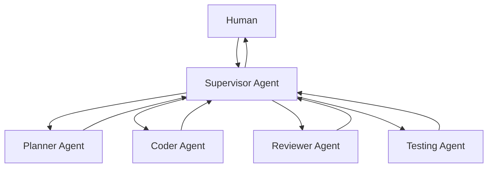
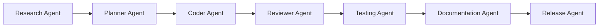
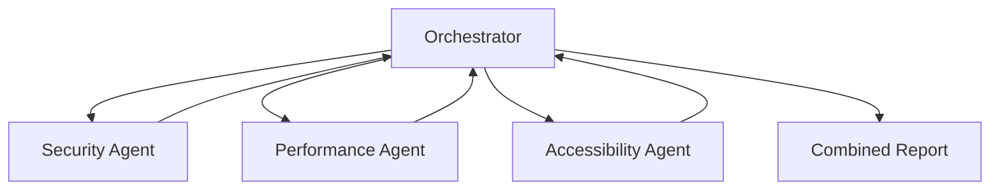
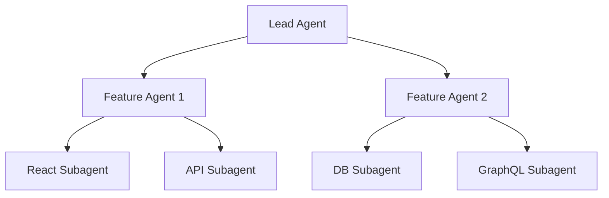
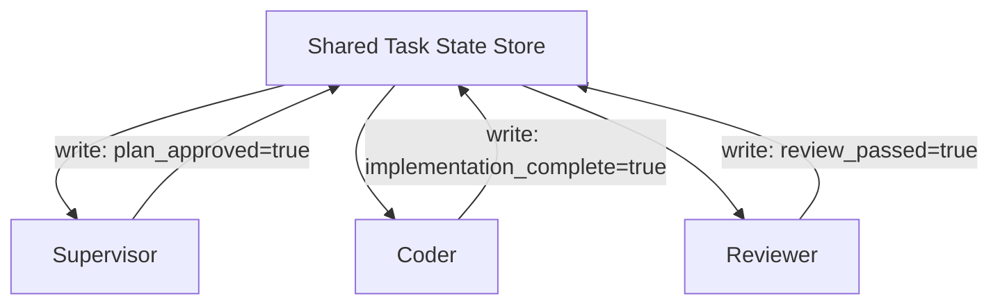

# Level 5: Multi-Agent Systems

> **Prerequisites:** Level 4: Agent Engineering
> **Goal:** Orchestrate multiple agents reliably, with defined communication protocols and failure isolation

---

## Why Multi-Agent Systems

Single agents hit fundamental limits:
- **Context saturation:** Long tasks fill the context window, degrading reasoning
- **Tool overload:** Many tools degrade agent tool selection accuracy
- **Specialization:** A generalist agent cannot match a specialist on specific domains
- **Parallelization:** Sequential single-agent execution cannot parallelize independent work
- **Isolation:** A failed action in a single agent affects the entire task

Multi-agent systems solve these through separation of concerns. The key principle: **separate agents maintain separate contexts, enabling specialization and isolation.**

**When NOT to use multi-agent systems:**
- Single-step tasks
- Tasks that fit in one context window
- Tasks with no natural separation of concerns
- Teams that don't yet have reliable single agents (fix single agent reliability first)

---

## Architecture Patterns

### Pattern 1: Supervisor Pattern (Most Common)



**When to use:** Complex tasks where a coordinator needs to delegate to and monitor specialists.
**Key property:** The supervisor maintains the overall plan and state; specialists execute focused subtasks.

### Pattern 2: Pipeline Pattern



**When to use:** Tasks with a clear sequential dependency — each stage feeds the next.
**Key property:** Each agent's output is the next agent's input. No shared state.

### Pattern 3: Parallel Specialist Pattern



**When to use:** Independent checks that can run simultaneously.
**Key property:** Agents work in parallel on separate concerns; orchestrator combines results.

### Pattern 4: Hierarchical Pattern



**When to use:** Very large tasks that decompose into independent sub-features.
**Key property:** Multiple levels of delegation; top-level maintains business context.

---

## Communication Protocol (OAIES Standard)

All agent-to-agent communication uses a standard message schema:

```typescript
interface AgentMessage {
  // Routing
  from: string;              // Sending agent ID
  to: string;                // Receiving agent ID
  session_id: string;        // Shared across all agents in this task
  message_id: string;        // UUID for this message
  
  // Content
  type: MessageType;         // "task" | "result" | "question" | "escalation" | "complete"
  priority: "high" | "normal";
  
  // Task context (included in every message)
  task_context: {
    story_id: string;        // The story this task belongs to
    objective: string;       // What the overall task is achieving
    constraints: string[];   // Active constraints (security, performance, etc.)
  };
  
  // Message body
  content: string;           // The actual message content
  artifacts: Artifact[];     // Files, plans, or code produced
  
  // State management
  requires_response: boolean;
  timeout_seconds: number;
  escalation_target: string; // Who to escalate to if this message is not answered
}

type MessageType = 
  | "task"        // Delegating a task
  | "result"      // Returning a completed task result
  | "question"    // Asking for clarification (blocks until answered)
  | "escalation"  // Agent cannot proceed without human input
  | "complete";   // Task fully complete, session can close
```

---

## State Management

**The critical challenge in multi-agent systems:** How do agents share state without creating coupling?

### OAIES State Management Pattern



**Rules:**
1. State is stored in one place — not in any individual agent's context
2. Agents read and write state explicitly — no implicit context passing
3. Every state change is logged (who changed what, when)
4. State schema is defined upfront — agents cannot add arbitrary state

### Minimum State Schema

```typescript
interface TaskState {
  task_id: string;
  status: "planning" | "implementing" | "reviewing" | "testing" | "complete" | "failed";
  
  // Gate states (boolean flags that must be set before next stage)
  gates: {
    plan_approved: boolean;         // Human approved the plan
    implementation_complete: boolean;
    review_passed: boolean;
    tests_passing: boolean;
    security_approved: boolean;
    deployment_approved: boolean;
  };
  
  // Artifacts
  artifacts: {
    implementation_plan?: string;   // File path or content
    code_files?: string[];          // File paths
    test_results?: string;          // Test output
    review_report?: string;         // Review findings
  };
  
  // Agent status
  active_agents: string[];
  completed_agents: string[];
  failed_agents: string[];
}
```

---

## Failure Isolation

**The most important property of a multi-agent system:** a failing agent should not corrupt the overall task.

### Failure Isolation Pattern

```python
async def execute_agent_task(agent: Agent, task: Task, state: TaskState) -> AgentResult:
    """Execute an agent task with full isolation."""
    try:
        result = await agent.execute(task, timeout=agent.timeout_seconds)
        
        # Validate agent output before accepting it
        validated = await validate_output(result, expected_schema=task.output_schema)
        
        # Update state only after validation
        await state.update(agent.id, status="complete", artifacts=validated.artifacts)
        
        return validated
        
    except AgentTimeoutError:
        await state.update(agent.id, status="failed", reason="timeout")
        await escalate_to_human(f"Agent {agent.id} timed out. Current state: {state.summary()}")
        raise
        
    except AgentLoopError:
        await state.update(agent.id, status="failed", reason="loop_detected")
        await escalate_to_human(f"Agent {agent.id} detected loop. Last action: {agent.last_action}")
        raise
        
    except ValidationError as e:
        await state.update(agent.id, status="failed", reason=f"invalid_output: {e}")
        # Don't escalate — try recovery
        return await retry_with_different_context(agent, task, state, error=e)
```

---

## Framework Integrations

### LangGraph (Recommended for Stateful Graphs)
See [frameworks/langgraph/](./frameworks/langgraph/) for:
- Graph definition patterns
- State management with LangGraph
- Human-in-the-loop integration
- Streaming output

### AutoGen (Microsoft)
See [frameworks/autogen/](./frameworks/autogen/) for:
- Conversation-based multi-agent setup
- GroupChat patterns
- Tool registration

### CrewAI (Role-Based)
See [frameworks/crewai/](./frameworks/crewai/) for:
- Crew and role definition
- Task delegation patterns
- Sequential vs. parallel execution

---

## Anti-Patterns

### ❌ Agents That Share Context Windows
If agents share the same context window, you have one agent with multiple roles — not a multi-agent system. Context sharing defeats the purpose.

### ❌ No Communication Schema
Agents that communicate via free-form text cannot be reliably parsed, monitored, or debugged. Structured message schemas are required.

### ❌ Coordinator Without Authority
A supervisor that can only suggest but not direct is an advisory board, not an orchestrator. The supervisor must have authority to terminate failing agents and reassign tasks.

### ❌ No Failure Isolation
A system where one failing agent brings down the entire task is not a multi-agent system — it's a pipeline with multiple failure points and no recovery.

---

## Readiness Gate

Before deploying a multi-agent system, verify:
- [ ] Single agent system reliable (before adding multi-agent complexity)
- [ ] Communication schema defined and versioned
- [ ] State management centralized (not distributed across agent contexts)
- [ ] Failure isolation tested (kill one agent, verify task continues or escalates gracefully)
- [ ] Human escalation path tested end-to-end
- [ ] All agent interactions logged in audit trail
- [ ] Total system timeout enforced (not just per-agent timeout)
- [ ] Cost per task bounded and monitored
