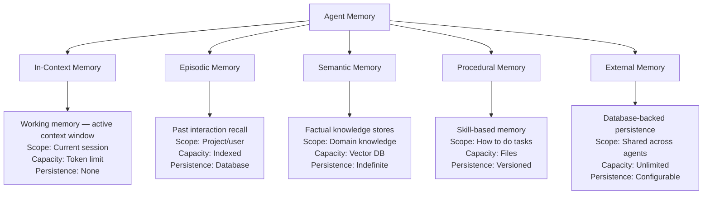
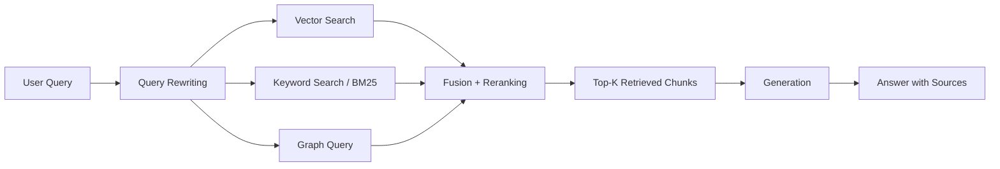

# Level 6: Memory & Knowledge Systems

> **Prerequisites:** Level 5: Multi-Agent Systems
> **Goal:** Give agents persistent memory, accumulated knowledge, and the ability to learn from experience

---

## Why Memory Matters

Stateless agents cannot:
- Learn from past mistakes within a project
- Accumulate domain knowledge over time
- Recognize patterns across sessions
- Provide consistent behavior based on established team preferences
- Avoid repeating the same debugging process for recurring issues

Memory transforms a stateless LLM invocation into an agent that gets smarter with use.

---

## Memory Type Taxonomy



---

## When to Use Each Memory Type

| Memory Type | Use When | Storage | Example |
|-------------|---------|---------|---------|
| **In-Context** | Current task needs full context | None (ephemeral) | Current code being reviewed |
| **Episodic** | Agent needs to recall past decisions or interactions | Vector DB + metadata | "We tried X in sprint 3 and it failed because..." |
| **Semantic** | Agent needs domain knowledge beyond training | Vector DB | Company architecture docs, API references |
| **Procedural** | Agent needs skill knowledge | Files (.skill.md) | How to debug React rendering issues |
| **External** | Persistent state across sessions and agents | Database | Task state, project decisions, user preferences |

---

## Contents

### Memory Types
- [memory-types/in-context.md](./memory-types/in-context.md) — Working memory patterns and compression
- [memory-types/episodic.md](./memory-types/episodic.md) — Past interaction retrieval
- [memory-types/semantic.md](./memory-types/semantic.md) — Factual knowledge stores
- [memory-types/procedural.md](./memory-types/procedural.md) — Skills and workflow memory
- [memory-types/external.md](./memory-types/external.md) — Database-backed persistence

### Knowledge Graphs
- [knowledge-graphs/construction.md](./knowledge-graphs/construction.md) — Building knowledge graphs from text
- [knowledge-graphs/querying.md](./knowledge-graphs/querying.md) — Graph traversal for RAG
- [knowledge-graphs/maintenance.md](./knowledge-graphs/maintenance.md) — Keeping knowledge current

### Vector Databases
- [vector-databases/selection-guide.md](./vector-databases/selection-guide.md) — Pinecone vs Weaviate vs Qdrant vs pgvector
- [vector-databases/indexing-patterns.md](./vector-databases/indexing-patterns.md) — Chunking, embedding, metadata
- [vector-databases/retrieval-optimization.md](./vector-databases/retrieval-optimization.md) — Hybrid search, reranking

### RAG Systems
- [rag/naive-rag.md](./rag/naive-rag.md) — Basic retrieval-augmented generation
- [rag/advanced-rag.md](./rag/advanced-rag.md) — Query rewriting, reranking, fusion
- [rag/hybrid-rag.md](./rag/hybrid-rag.md) — Vector + keyword + graph (the OAIES standard)
- [rag/agentic-rag.md](./rag/agentic-rag.md) — Agent-driven retrieval strategies

---

## The OAIES RAG Standard: Hybrid RAG

**The OAIES standard for RAG is hybrid retrieval. Not vector-only.**



**Why hybrid:**
- Vector search finds semantically similar content but misses exact keyword matches
- Keyword search finds exact matches but misses paraphrased content
- Graph retrieval finds entity relationships that neither can find
- Fusion of all three achieves >90% recall on knowledge-intensive questions

**Why not vector-only:**
Vector-only RAG achieves ~65-75% recall in practice. For knowledge-intensive applications (legal, medical, technical documentation), this means 25-35% of questions cannot be answered correctly — not because the information doesn't exist, but because retrieval failed.

---

## Vector Database Selection Guide

| Database | Best For | When to Choose |
|---------|---------|---------------|
| **pgvector** | Starting out, PostgreSQL already in stack | <10M vectors, want simplicity |
| **Pinecone** | Managed, scale, low ops burden | >10M vectors, managed preferred |
| **Qdrant** | Self-hosted, full control, open-source | Security requirements prevent managed |
| **Weaviate** | Multi-modal, graph + vector hybrid | Need graph traversal with vectors |
| **Chroma** | Development, prototyping | Local development only |

**OAIES default:** Start with `pgvector` (zero additional infrastructure). Migrate to Qdrant or Pinecone when you exceed 5M vectors or need horizontal scaling.

---

## Context Compression for Long-Running Agents

As conversations grow, context fills. Without compression, agents eventually hit the context limit and lose information.

```python
class ConversationCompressor:
    """OAIES standard: compress conversation history at regular intervals."""
    
    COMPRESS_AT_TOKENS = 60_000  # Compress when approaching 60k tokens
    KEEP_LAST_N = 5              # Always keep last 5 messages verbatim
    
    async def compress(self, messages: list[Message]) -> list[Message]:
        """Compress older messages while preserving recent context."""
        if count_tokens(messages) < self.COMPRESS_AT_TOKENS:
            return messages  # No compression needed
        
        recent = messages[-self.KEEP_LAST_N:]
        older = messages[:-self.KEEP_LAST_N]
        
        # Summarize older messages
        summary = await self.summarize(older)
        
        # Replace older messages with summary
        summary_message = Message(
            role="system",
            content=f"[Summary of {len(older)} previous messages]: {summary}",
            metadata={"type": "compression", "messages_compressed": len(older)}
        )
        
        return [summary_message] + recent
```

**When to compress:** At 60% of context window (not at 100% — compression at 100% means you've already lost context quality).

---

## Anti-Patterns

### ❌ Infinite Conversation History
Storing every message forever creates: unbounded context growth, degraded retrieval, and privacy risks (you're retaining data you don't need).

**Fix:** Implement rolling compression. Keep last N turns verbatim, summarize everything older.

### ❌ Vector Search Only
As described above, vector-only RAG has 25-35% recall failures. For any production knowledge system, implement hybrid retrieval.

### ❌ Chunking Without Overlap
Splitting documents into non-overlapping chunks loses context at chunk boundaries. Use 10-20% overlap.

```python
# Wrong
chunks = split_text(document, chunk_size=500, overlap=0)

# Correct
chunks = split_text(document, chunk_size=500, overlap=50)  # 10% overlap
```

### ❌ No Memory Access Control
Memory systems often contain sensitive information (past decisions, user preferences, project details). Access to memory must be controlled by the same permission system as other data.

---

## Readiness Gate

Before proceeding to Level 7, verify:
- [ ] Memory type selected for each agent (appropriate to use case)
- [ ] Hybrid RAG implemented (vector + keyword minimum)
- [ ] Conversation compression implemented for long-running agents
- [ ] Vector database selected with scaling plan
- [ ] Memory access control enforced
- [ ] Memory content not retaining PII beyond necessity
- [ ] RAGAS evaluation suite running on RAG pipeline
- [ ] Retrieval recall ≥ 0.75 on representative queries
