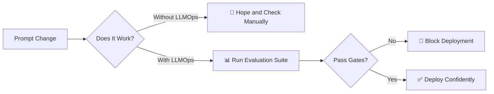
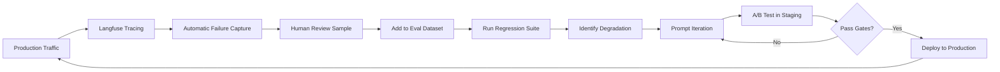

# Level 7: LLMOps

> **Prerequisites:** Levels 0-6
> **Goal:** Operate LLMs in production with reliability, observability, cost control, and continuous improvement

---

## Why LLMOps Is Not MLOps

MLOps manages the training, versioning, and deployment of models. LLMOps manages everything that happens **after** you call a frontier model API — and frontier model APIs are not something you train.

LLMOps is the operational discipline of:
- **Evaluation** — knowing when your system works and when it doesn't
- **PromptOps** — treating prompts as versioned, deployable artifacts
- **Cost management** — controlling token costs without sacrificing quality
- **Observability** — full tracing from user request to model response
- **Continuous improvement** — closing the production-to-evaluation feedback loop

---

## The Core Problem LLMOps Solves



Without LLMOps, every prompt change is a deployment risk. With LLMOps, prompt changes are as safe as code changes — because they have tests.

---

## Contents

### Evaluation
| File | What It Covers |
|------|----------------|
| [evaluation/framework-selection.md](./evaluation/framework-selection.md) | RAGAS vs DeepEval vs Promptfoo — when to use each |
| [Live Eval Script (eval/test_sample.py)](../eval/test_sample.py) | Working python test case using DeepEval for semantic relevancy |
| [evaluation/golden-set-management.md](./evaluation/golden-set-management.md) | Building and maintaining regression test suites |
| [evaluation/llm-as-judge.md](./evaluation/llm-as-judge.md) | Biases, calibration, and safeguards |
| [evaluation/continuous-eval.md](./evaluation/continuous-eval.md) | Embedding evaluation in production workflows |
| [evaluation/metrics/](./evaluation/metrics/) | Faithfulness, groundedness, context recall, hallucination rate |

### PromptOps
| File | What It Covers |
|------|----------------|
| [promptops/versioning.md](./promptops/versioning.md) | Prompts as immutable versioned artifacts |
| [promptops/registries.md](./promptops/registries.md) | Langfuse, PromptLayer, Braintrust comparison |
| [promptops/ab-testing.md](./promptops/ab-testing.md) | Traffic splitting between prompt versions |
| [promptops/staged-deployment.md](./promptops/staged-deployment.md) | dev → staging → production |
| [promptops/regression-gates.md](./promptops/regression-gates.md) | CI/CD blocks on prompt quality degradation |

### Cost Optimization
| File | What It Covers |
|------|----------------|
| [cost-optimization/model-routing.md](./cost-optimization/model-routing.md) | Route tasks to appropriate model tier |
| [cost-optimization/caching-strategies.md](./cost-optimization/caching-strategies.md) | Semantic caching, exact-match caching |
| [cost-optimization/token-budgets.md](./cost-optimization/token-budgets.md) | Enforced per-request token limits |

### Observability
| File | What It Covers |
|------|----------------|
| [observability/tracing.md](./observability/tracing.md) | OpenTelemetry + LangSmith/Langfuse |
| [observability/metrics.md](./observability/metrics.md) | Key LLM metrics to track |
| [observability/dashboards.md](./observability/dashboards.md) | Grafana dashboard templates |
| [observability/alerting.md](./observability/alerting.md) | Alert definitions and thresholds |

---

## The OAIES Evaluation Stack

**This is the standard. One stack. No "pick your favorite."**

| Layer | Tool | Purpose |
|-------|------|---------|
| **CI/CD Gate** | DeepEval | pytest-style evaluation that blocks bad deploys |
| **RAG Evaluation** | RAGAS | Retrieval and generation quality for RAG pipelines |
| **Security Testing** | Promptfoo | Adversarial testing and red teaming |
| **Production Monitoring** | Langfuse | Traces, cost, latency, quality in production |
| **A/B Testing** | Langfuse | Traffic splitting and metric comparison |

---

## PromptOps: The Minimum Viable Setup

```bash
# 1. Initialize a prompt registry (Langfuse example)
langfuse prompt create \
  --name "user-intent-classifier" \
  --content "prompts/user-intent-classifier.prompt.md" \
  --version 1.0 \
  --environment production

# 2. In code, fetch by name (never hardcode the prompt)
from langfuse import Langfuse
client = Langfuse()
prompt = client.get_prompt("user-intent-classifier", version="production")

# 3. When changing a prompt, deploy to staging first
langfuse prompt create \
  --name "user-intent-classifier" \
  --content "prompts/user-intent-classifier-v2.prompt.md" \
  --version 2.0 \
  --environment staging

# 4. Run regression tests against staging
deepeval test run --environment staging

# 5. If tests pass, promote to production
langfuse prompt promote --name "user-intent-classifier" --version 2.0 --environment production
```

---

## Cost Optimization: The Model Routing Standard

**Use the cheapest model that can do the job. Use expensive models only for tasks that require them.**

```python
# Model routing configuration (OAIES standard)
MODEL_ROUTING = {
    "classification": "gpt-4o-mini",        # Fast, cheap, good for simple classification
    "extraction": "gpt-4o-mini",            # Structured extraction from text
    "summarization": "gpt-4o-mini",         # Basic summarization
    "code_generation": "claude-sonnet-4",   # Complex code generation
    "architecture_review": "claude-opus-4", # High-stakes architectural decisions
    "creative_writing": "claude-sonnet-4",  # Creative content
    "rag_synthesis": "gpt-4o-mini",         # RAG response generation (context does the work)
    "complex_reasoning": "o3",              # Multi-step reasoning, math
}

def route_model(task_type: str, complexity: str = "standard") -> str:
    """Route task to appropriate model based on type and complexity."""
    if complexity == "high":
        # Upgrade to next tier for high-complexity variants
        return MODEL_ROUTING.get(f"{task_type}_complex", MODEL_ROUTING[task_type])
    return MODEL_ROUTING[task_type]
```

**Cost impact:** Teams implementing model routing typically reduce LLM API costs by 40-70% without measurable quality degradation for routed tasks.

---

## Observability: The Minimum Metrics

Every production LLM system MUST track:

| Metric | What It Measures | Alert Threshold |
|--------|-----------------|-----------------|
| `llm.latency.p50` | Median response time | >2s for user-facing |
| `llm.latency.p99` | Tail latency | >10s for user-facing |
| `llm.cost.per_request` | Token cost | >$0.10 per request |
| `llm.cost.daily` | Daily spend | >120% of budget |
| `llm.error_rate` | API error rate | >1% |
| `llm.evaluation.faithfulness` | RAG faithfulness score | <0.85 |
| `llm.evaluation.hallucination` | Hallucination rate | >2% |
| `llm.token.input.avg` | Average input tokens | Context growth monitoring |
| `llm.token.output.avg` | Average output tokens | Response bloat detection |

---

## Continuous Improvement Loop



This loop should run continuously in production. Not monthly. Not after incidents. Continuously.

---

## Anti-Patterns

### ❌ "We'll evaluate it manually"
Manual evaluation doesn't scale beyond 50 samples. At production scale (10k+ requests/day), you need automated evaluation. Build it from day one.

### ❌ "Our prompt hasn't changed so we don't need to re-evaluate"
**The model changes.** API providers update models. Fine-tuned models drift. Even with a frozen prompt, your evaluation suite must run on a schedule.

### ❌ "We use the most powerful model for everything"
A `gpt-4o-mini` call that classifies user intent costs 20-50x less than a `gpt-4o` call. For simple tasks, this is waste — not quality.

### ❌ "Our developers update prompts directly in production"
Prompts are deployable artifacts. They need staging environments, regression tests, and rollback capability — exactly like code.

---

## Readiness Gate

Before proceeding to Level 8, verify:
- [ ] DeepEval CI gate running on every PR that touches prompts
- [ ] RAGAS evaluation suite running for all RAG pipelines
- [ ] Langfuse (or equivalent) capturing all production traces
- [ ] Model routing implemented for at least 3 task types
- [ ] Cost dashboards showing daily and per-request costs
- [ ] Alert thresholds configured for all minimum metrics
- [ ] Prompt versioning in a registry (not hardcoded in source)
- [ ] A/B testing infrastructure validated with at least one test
