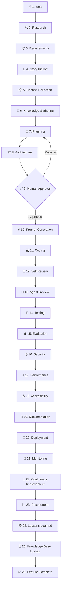

# Level 8: AI SDLC

> **Prerequisites:** Levels 0-7
> **Goal:** Operate a complete, auditable AI-enhanced software development lifecycle

---

## The Standard

This is the OAIES workflow. **Every feature follows this flow. No shortcuts. No exceptions.**

Teams that skip stages don't move faster. They move to production faster and to incidents faster.

---

## The 26-Stage OAIES SDLC

---

## Stage Prompts

Each stage has a dedicated production prompt. Use them.

| Stage | Prompt File |
|-------|-------------|
| Story Kickoff | [story-kickoff.prompt.md](./prompts/story-kickoff.prompt.md) |
| Implementation Plan | [implementation-plan.prompt.md](./prompts/implementation-plan.prompt.md) |
| Architecture Review | [architecture-review.prompt.md](./prompts/architecture-review.prompt.md) |
| Coding | [coding.prompt.md](./prompts/coding.prompt.md) |
| Refactoring | [refactoring.prompt.md](./prompts/refactoring.prompt.md) |
| Security Review | [security-review.prompt.md](./prompts/security-review.prompt.md) |
| Performance Review | [performance-review.prompt.md](./prompts/performance-review.prompt.md) |
| Test Generation | [test-generation.prompt.md](./prompts/test-generation.prompt.md) |
| Documentation | [documentation.prompt.md](./prompts/documentation.prompt.md) |
| Release | [release.prompt.md](./prompts/release.prompt.md) |
| Incident | [incident.prompt.md](./prompts/incident.prompt.md) |
| Root Cause Analysis | [root-cause-analysis.prompt.md](./prompts/root-cause-analysis.prompt.md) |
| Migration | [migration.prompt.md](./prompts/migration.prompt.md) |
| Technical Debt | [technical-debt.prompt.md](./prompts/technical-debt.prompt.md) |
| Knowledge Capture | [knowledge-capture.prompt.md](./prompts/knowledge-capture.prompt.md) |

---

## Quality Standards

| Standard | Definition |
|----------|-----------|
| [Definition of Ready](./quality-standards/definition-of-ready.md) | What must be true before coding starts |
| [Definition of Done](./quality-standards/definition-of-done.md) | What must be true before release |
| [Prompt Quality](./quality-standards/prompt-quality-standard.md) | Minimum bar for all prompts |
| [Agent Quality](./quality-standards/agent-quality-standard.md) | Minimum bar for all agents |
| [Code Quality](./quality-standards/code-quality-standard.md) | Minimum bar for all code |

---

## Stage Details

### Stage 4: Story Kickoff (Critical)

This is the most important stage. A poor kickoff creates compounding waste in every subsequent stage.

A kickoff must produce:
1. Clear acceptance criteria (testable, unambiguous)
2. Technical approach outline (not detailed, but directional)
3. Risk identification (what could go wrong)
4. Context list (what information the agent needs)
5. Estimation (rough complexity, not precise hours)

Use [story-kickoff.prompt.md](./prompts/story-kickoff.prompt.md).

### Stage 9: Human Approval (Non-Negotiable)

The architecture and implementation plan MUST be approved by a human before coding starts. This is the primary quality gate. No exceptions for "small features" — the most dangerous bugs are in "small features" with unchecked assumptions.

**What human approval requires:**
- Reviewer must be able to explain the plan back in their own words
- Reviewer must explicitly approve by name and date
- Rejection must include specific concerns — "looks fine" is not rejection criteria

### Stage 12: Self Review (Before Any Human Review)

The agent reviews its own output before any human looks at it. This is not a courtesy — it catches 40-60% of issues that would otherwise require a human review cycle.

Self review checklist:
- [ ] Does the code do what the requirements specified?
- [ ] Are all edge cases handled?
- [ ] Is error handling complete?
- [ ] Are there security concerns?
- [ ] Is the code readable without comments?
- [ ] Do tests cover the new behavior?

### Stage 25: Knowledge Base Update (Often Skipped — Never Should Be)

Every completed feature produces institutional knowledge. The only question is whether you capture it deliberately (in your knowledge base) or accidentally (in your team's memory, which is lossy).

The knowledge capture prompt extracts: decisions made, problems encountered, solutions found, patterns to reuse, patterns to avoid.

---

## Enterprise Considerations

- **Audit trail:** Every stage must produce a documented artifact (plan, review, test report). The audit trail is not optional — it's your compliance evidence.
- **Human approval gates:** In regulated industries, stages 9, 16 (Security), and 20 (Deployment) require named human sign-offs.
- **Stage skipping:** Never permitted. If a stage seems unnecessary for a small change, you have misunderstood the change or misunderstood the standard.

---

## Anti-Patterns

### ❌ "We'll write tests after the feature ships"
Stage 14 (Testing) comes before Stage 20 (Deployment). This is not negotiable. Shipping untested code is shipping known risk.

### ❌ "The architecture review is just documentation"
Stage 9 (Human Approval) is a decision gate. It is not documentation. If the reviewer doesn't push back, they didn't review — they rubber-stamped.

### ❌ "The agent will catch any issues"
Stage 13 (Agent Review) improves quality. It does not guarantee quality. Stage 12 (Self Review) + Stage 13 (Agent Review) + Stage 14 (Testing) all exist because no single layer is sufficient.

### ❌ "Knowledge capture isn't worth the time"
Teams that skip Stage 25 repeat the same mistakes in identical situations 3 months later with zero memory of having solved them before. The knowledge capture prompt takes 5 minutes.
