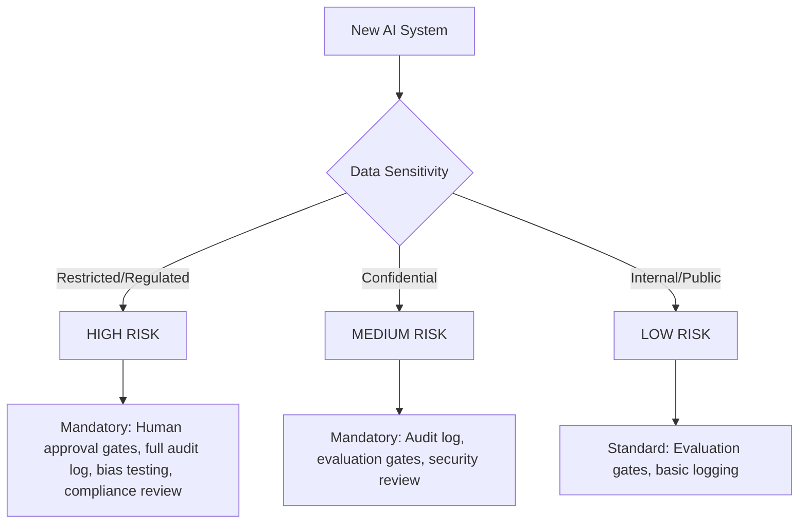
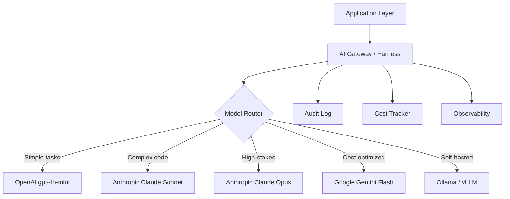

# Level 9: Enterprise AI Architecture

> **Prerequisites:** Levels 0-8
> **Goal:** Deploy AI systems that meet enterprise governance, compliance, security, and scale requirements

---

## Why Enterprise AI Is Different

Most AI engineering content targets startups: move fast, ship fast, iterate fast. Enterprise AI engineering operates under additional constraints that change the architecture:

- **Compliance:** EU AI Act, GDPR, HIPAA, SOC 2, ISO 27001
- **Audit requirements:** Every AI decision must be explainable and traceable
- **Scale:** 100k-10M daily users, multi-region, multi-tenant
- **Security posture:** Strict data isolation, least privilege, zero-trust
- **Governance:** AI usage policies, approval workflows, change management
- **Risk management:** AI systems categorized by risk level, with controls proportional to risk

These are not optional features for enterprise. They are architectural requirements.

---

## Contents

### Governance
| File | What It Covers |
|------|----------------|
| [governance/eu-ai-act.md](./governance/eu-ai-act.md) | EU AI Act compliance framework |
| [governance/gdpr-for-ai.md](./governance/gdpr-for-ai.md) | GDPR implications for AI systems |
| [governance/rbac-patterns.md](./governance/rbac-patterns.md) | Role-based access control for AI agents |
| [governance/audit-logging.md](./governance/audit-logging.md) | Mandatory audit trail specification |
| [governance/responsible-ai.md](./governance/responsible-ai.md) | Responsible AI framework |

### Security
| File | What It Covers |
|------|----------------|
| [security/prompt-injection-defense.md](./security/prompt-injection-defense.md) | Defense-in-depth against injection |
| [security/sandboxing.md](./security/sandboxing.md) | Tool execution isolation |
| [security/least-privilege.md](./security/least-privilege.md) | Principle of least privilege for AI |
| [security/oauth-for-mcp.md](./security/oauth-for-mcp.md) | OAuth 2.1 for MCP servers |
| [security/red-teaming.md](./security/red-teaming.md) | AI red teaming methodology |

### Architecture Patterns
| File | What It Covers |
|------|----------------|
| [architecture-patterns/provider-neutral-harness.md](./architecture-patterns/provider-neutral-harness.md) | Provider-agnostic AI infrastructure |
| [architecture-patterns/model-routing-gateway.md](./architecture-patterns/model-routing-gateway.md) | Centralized model routing |
| [architecture-patterns/centralized-prompt-registry.md](./architecture-patterns/centralized-prompt-registry.md) | Enterprise prompt management |

### Templates
| Template | Purpose |
|----------|---------|
| [templates/adr.template.md](./templates/adr.template.md) | Architecture Decision Record |
| [templates/prd.template.md](./templates/prd.template.md) | Product Requirements Document |
| [templates/rfc.template.md](./templates/rfc.template.md) | Request for Comments |
| [templates/runbook.template.md](./templates/runbook.template.md) | Operational runbook |
| [templates/incident-report.template.md](./templates/incident-report.template.md) | Incident report |
| [templates/rca.template.md](./templates/rca.template.md) | Root cause analysis |

---

## The Enterprise AI Risk Framework

All AI systems deployed in enterprise must be classified by risk:



**Risk classification determines required controls. There are no exceptions.**

| Risk Level | Examples | Required Controls |
|-----------|---------|------------------|
| **HIGH** | Medical decisions, credit scoring, hiring, law enforcement | Full human-in-loop, audit trail, bias testing, regulatory disclosure |
| **MEDIUM** | Customer service, content moderation, document processing | Audit log, evaluation gates, quarterly bias review |
| **LOW** | Internal tools, code assistance, documentation | Evaluation gates, basic logging |

---

## The Provider-Neutral Architecture

**Never write AI infrastructure that only works with one provider.**



```python
# The correct abstraction
class AIGateway:
    """Provider-neutral AI gateway. Application code never calls provider SDKs directly."""
    
    def __init__(self, router: ModelRouter, harness: Harness, logger: AuditLogger):
        self.router = router
        self.harness = harness
        self.logger = logger
    
    async def complete(
        self,
        task_type: str,
        messages: list[Message],
        user_id: str,
        session_id: str
    ) -> CompletionResult:
        # Validate input through harness
        validated = await self.harness.validate_input(messages, user_id)
        
        # Route to appropriate model
        model = self.router.select(task_type, complexity=validated.complexity)
        
        # Call model (provider-neutral interface)
        response = await model.complete(validated.messages)
        
        # Validate output
        validated_response = await self.harness.validate_output(response)
        
        # Audit log every call
        await self.logger.log(
            user_id=user_id,
            session_id=session_id,
            model=model.identifier,
            input_tokens=response.usage.input_tokens,
            output_tokens=response.usage.output_tokens,
            cost_usd=response.cost_usd,
            action_taken=str(validated_response.action),
            latency_ms=response.latency_ms
        )
        
        return validated_response
```

---

## Audit Logging Standard

**Every enterprise deployment MUST implement this audit log standard.**

```typescript
interface AIAuditLog {
  // Identity
  timestamp: string;          // ISO8601
  session_id: string;         // UUID
  user_id: string;            // Authenticated user identifier
  tenant_id: string;          // For multi-tenant systems
  
  // Request
  request_id: string;         // UUID for this specific request
  task_type: string;          // What kind of task
  input_hash: string;         // SHA-256 of input (not raw input — PII protection)
  
  // Model
  model_provider: string;     // "openai" | "anthropic" | "google" | etc.
  model_id: string;           // "gpt-4o" | "claude-sonnet-4" | etc.
  model_version: string;      // API version or model hash
  
  // Tokens and Cost
  input_tokens: number;
  output_tokens: number;
  cost_usd: number;
  
  // Outcome
  action_proposed: string;    // What the model suggested
  action_approved: boolean;   // Did the harness approve it?
  approval_reason: string;    // If rejected, why
  action_executed: string;    // What actually happened
  
  // Quality
  latency_ms: number;
  evaluation_score?: number;  // If evaluated in real-time
  
  // Compliance
  data_classification: string;// "public" | "internal" | "confidential" | "restricted"
  regulatory_scope: string[]; // ["GDPR", "HIPAA"] — applicable regulations
  consent_verified: boolean;  // Was user consent verified for this data use?
}
```

**Storage requirements:**
- Minimum retention: 2 years (check your regulatory requirements — HIPAA = 6 years, GDPR = as long as necessary)
- Tamper-evident storage (append-only, signed)
- Encrypted at rest and in transit
- Access control: only authorized personnel can read logs
- Regular access audits

---

## Enterprise Anti-Patterns

### ❌ "We'll add compliance later"
Compliance is an architectural concern. Adding it to a deployed system means replacing the foundation. Start compliant.

### ❌ "The model is the security boundary"
System prompts, role definitions, and model instructions are not security boundaries. The harness is. Anything that depends on model behavior for security is an incident waiting to happen.

### ❌ "One model for everything"
Provider concentration risk + cost inefficiency + missing specialized capabilities. Enterprise systems must route to appropriate models.

### ❌ "Our AI system is internal, so it doesn't need security controls"
80%+ of data breaches are caused by internal threat actors or compromised internal credentials. Internal systems need security controls.

### ❌ "Audit logs are for compliance, not engineering"
Audit logs are your primary debugging tool for AI system behavior in production. Engineers who ignore them are flying blind.

---

## Readiness Gate

Before calling your system enterprise-ready, verify:
- [ ] AI risk classification completed and documented
- [ ] Audit log standard implemented (all fields)
- [ ] Provider-neutral gateway in place
- [ ] Least privilege enforced (every tool and data access)
- [ ] Prompt injection defense implemented (harness layer, not prompt layer)
- [ ] Multi-tenant context isolation verified at database level
- [ ] EU AI Act / applicable regulation compliance review completed
- [ ] Incident response plan covers AI-specific failure modes
- [ ] Quarterly bias audit scheduled
- [ ] Data retention and deletion policy implemented
