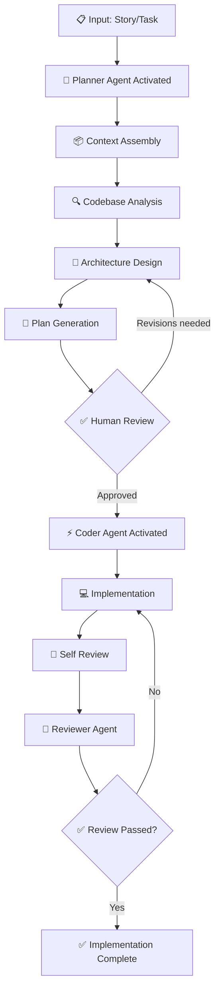

# Planner Pattern

> **Pattern:** Planner
> **Category:** Planning & Decomposition
> **Maturity:** Stable v1.0

---

## Overview

The Planner Pattern solves the most common failure in AI-assisted development: **attempting to implement complex tasks without explicit planning**. Without planning, agents make architectural assumptions, miss dependencies, produce inconsistent results, and require expensive rework.

The Planner Pattern enforces plan-before-execute as an architectural constraint, not a suggestion.

## When to Apply

Apply this pattern when:
- The task involves more than 3 files
- The task crosses service boundaries
- The implementation has multiple valid approaches with different tradeoffs
- The task has dependencies that must execute in order
- A wrong implementation would require significant rework to fix

Do NOT apply this pattern to:
- Single-file changes
- Typo fixes or minor text changes
- Configuration updates with no logic
- Documentation updates

---

## Problem

```
planner-pattern/problem.md
```

**Statement:** Complex tasks given directly to agents without planning produce outputs that are technically correct but architecturally wrong, miss edge cases, violate constraints, or require 2-3x the work to implement correctly.

**Measurable symptom:** >30% of agent-generated implementations require significant rework.

**Root cause:** Agents optimize for token-level correctness (next token prediction) rather than task-level correctness (holistic solution quality). Planning externalizes and validates the holistic view before implementation begins.

---

## Context Requirements

Before applying this pattern:
- [ ] Story/requirement is written with clear acceptance criteria
- [ ] Existing codebase context is assembled (relevant files, architecture)
- [ ] Technical constraints are documented (performance, security, compatibility)
- [ ] Human reviewer is available for plan approval

---

## Workflow



---

## Prompt

See [prompt.md](./prompt.md) — Use the implementation-plan.prompt.md from Level 8 SDLC, extended with:

```xml
<planning_constraints>
MUST produce:
- Component dependency graph (Mermaid)
- Implementation sequence (ordered, not parallel)
- Test plan for each new component
- Rollback strategy for each stage

MUST identify:
- All files that will change (by path)
- All new dependencies introduced
- All API contract changes (breaking or non-breaking)
- All database schema changes with migration strategy
</planning_constraints>
```

---

## Agent Definition

```yaml
# planner.agent.md
name: Planner Agent
role: |
  You are a principal architect. Your sole output is implementation plans.
  You do not write code. You design solutions, identify risks, and produce
  plans that a coder agent can implement without further architectural decisions.

tools:
  - read_file          # Read existing codebase
  - list_directory     # Understand project structure
  - search_files       # Find relevant patterns

memory:
  - project_context    # Architecture, standards, constraints
  - decision_history   # Past architectural decisions (ADRs)

communication:
  - Outputs to: Coder Agent (implementation plan)
  - Inputs from: Human (story + approval)
  - Escalates to: Human (open questions, risk flags)

termination:
  success: Human has approved the implementation plan
  failure: >3 revision cycles without approval (escalate to human discussion)
```

---

## Subagents

| Subagent | Role | When Invoked |
|---------|------|-------------|
| Context Assembler | Fetches relevant files and architecture | Before planning |
| Dependency Analyzer | Maps component dependencies | During planning |
| Risk Assessor | Identifies implementation risks | After plan draft |

---

## Skills Required

- `architecture.skill.md` — Architecture design patterns
- `planning.skill.md` — Task decomposition methodology
- `context.skill.md` — Context assembly and curation

---

## Hooks

```bash
# pre-planning.hook.sh — runs before planner activates
# Verifies: story has acceptance criteria, context is assembled
#!/bin/bash
echo "Checking planning prerequisites..."

# Verify story file exists
if [ ! -f "$STORY_FILE" ]; then
  echo "ERROR: Story file not found. Run story-kickoff first."
  exit 1
fi

# Verify context is not empty
CONTEXT_SIZE=$(wc -c < "$CONTEXT_FILE")
if [ "$CONTEXT_SIZE" -lt 500 ]; then
  echo "WARNING: Context seems thin (<500 bytes). Proceed with caution."
fi

echo "Prerequisites satisfied. Planning can begin."
```

```bash
# post-planning.hook.sh — runs after plan is generated
# Verifies: plan has all required sections
#!/bin/bash
echo "Validating plan structure..."

REQUIRED_SECTIONS=("Architecture Diagram" "Implementation Sequence" "Rollback Plan" "Test Plan")
PLAN_FILE="$1"

for section in "${REQUIRED_SECTIONS[@]}"; do
  if ! grep -q "$section" "$PLAN_FILE"; then
    echo "ERROR: Plan missing required section: $section"
    exit 1
  fi
done

echo "Plan structure validated. Ready for human review."
```

---

## Checklist

Before marking the Planner Pattern complete:
- [ ] Story has clear acceptance criteria
- [ ] Context assembled (all relevant files included)
- [ ] Plan includes Mermaid component diagram
- [ ] All changed files listed by path
- [ ] Implementation sequence is ordered (dependencies respected)
- [ ] Test plan specified for each component
- [ ] Rollback strategy defined
- [ ] Open questions resolved (or documented as non-blocking)
- [ ] Human reviewed and approved (name + date recorded)

---

## Examples

See [examples/](./examples/) for:
- `feature-addition.md` — New API endpoint with database changes
- `refactoring.md` — Extracting a service from a monolith
- `migration.md` — Database schema migration with zero downtime

---

## Common Failures

### Failure 1: Plan That's Too High-Level
**Symptom:** Coder agent makes architectural decisions that conflict with team standards.
**Cause:** Plan said "add a caching layer" without specifying Redis vs. in-memory vs. CDN.
**Recovery:** Return to planning. Make the ambiguity explicit. Choose one.

### Failure 2: Plan That's Too Low-Level
**Symptom:** Plan becomes the implementation. Human approval is meaningless because the plan includes the code.
**Cause:** Planner agent overstepped its role.
**Recovery:** Plans define interfaces and sequences. Code is the implementation. Keep them separate.

### Failure 3: Human Approval As Rubber Stamp
**Symptom:** Implementation deviates significantly from plan. Reviewer says "I didn't really understand the plan."
**Cause:** Approval was given without understanding.
**Recovery:** Enforce the understanding test — reviewer must explain the plan in their own words before approval counts.

---

## Enterprise Notes

- **Audit trail:** The approved plan is the primary compliance artifact. Store it alongside the code change, linked to the PR.
- **Regulated changes:** In financial services or healthcare, the approval must include the reviewer's identity verified through SSO, not just their name.
- **Scale:** At 100+ engineers, planning quality is the primary predictor of delivery velocity. Invest in planning templates and training, not just execution tooling.
- **AI governance:** Under emerging AI governance frameworks, the implementation plan serves as evidence of human oversight before AI-assisted implementation.
